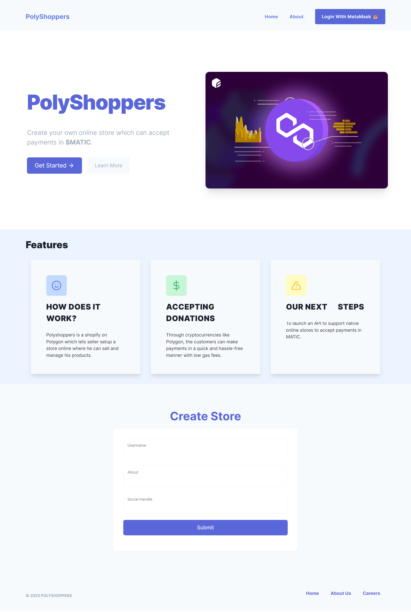
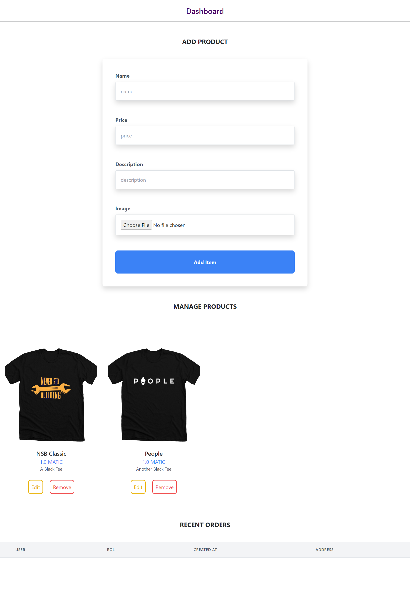
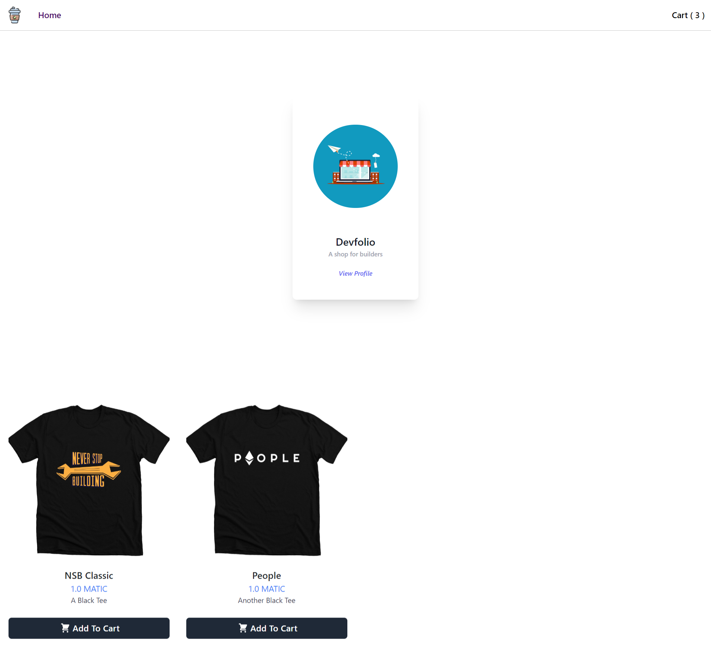

# PolyShoppers
Create your own online store which can accept payments in $MATIC.
Polyshoppers is a shopify on Polygon which lets seller setup a store online where he can sell and manage his products.
Through cryptocurrencies like Polygon, the customers can make payments in a quick and hassle-free manner with low gas fees.


## Clone this repo

```bash
git clone https://github.com/meta-ps/PolyShoppers.git
```

## Run

Make sure you have `python` and `Django` install then run

```python
npm i
python manage.py makemigrations PolyShoppers
python manage.py migrate
python manage.py runserver
```

## UI

### Home Page




### Seller Dashboard



### Customer Dashboard




